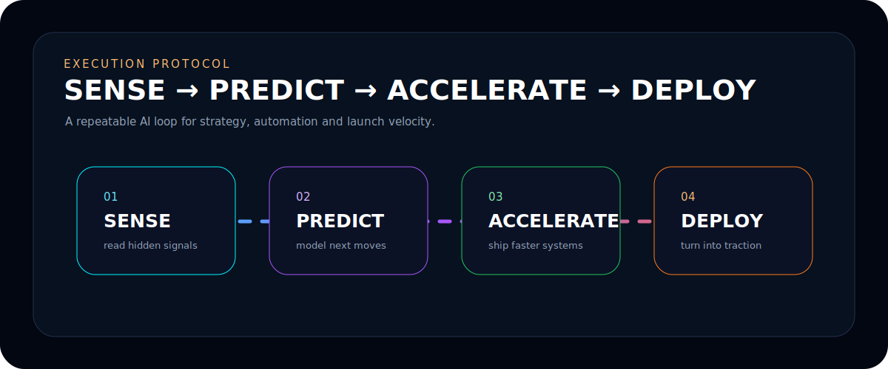
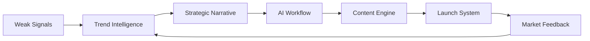
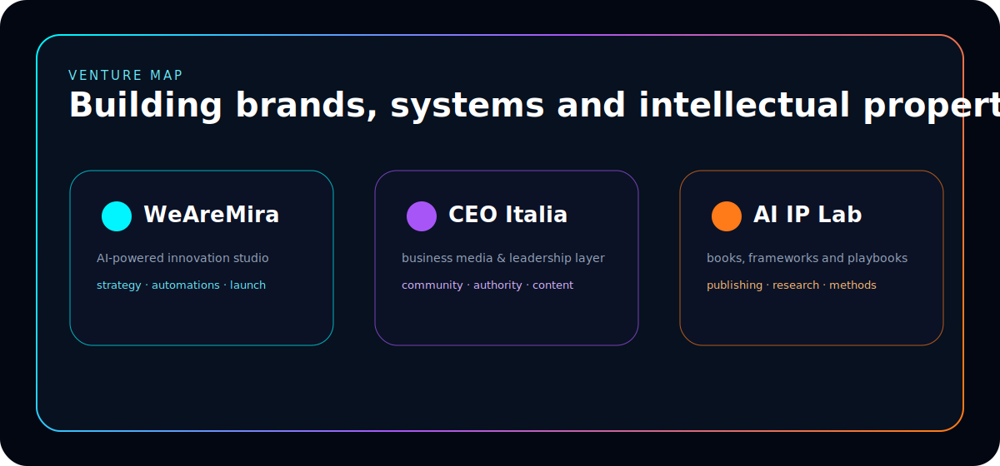
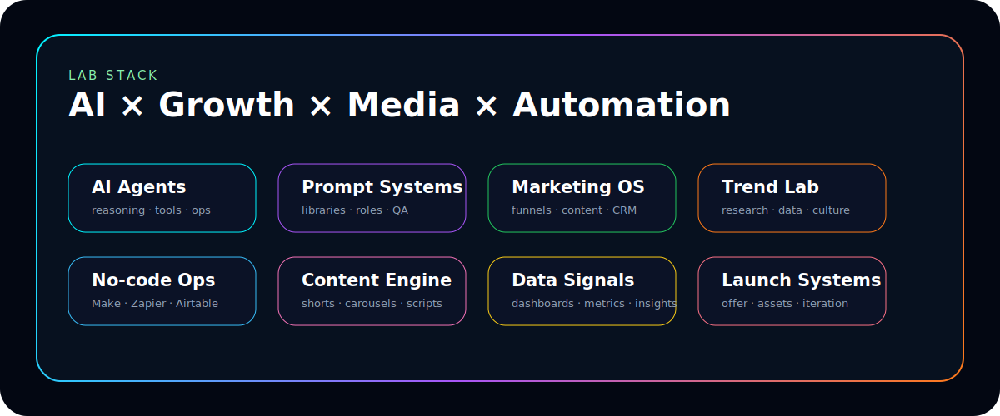
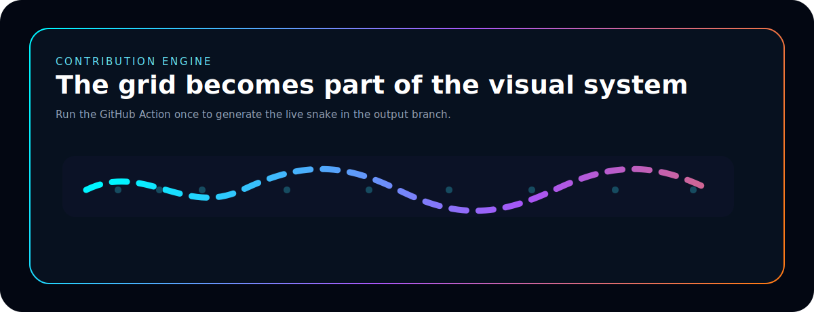
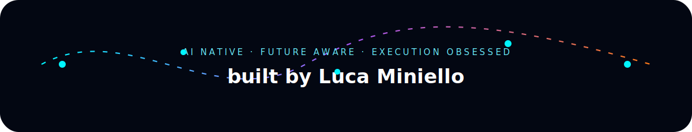

<!--
  Luca Miniello — AI Profile OS V4
  Upload-ready GitHub profile README.
  Required folders:
  - assets/
  - .github/workflows/snake.yml
-->

<p align="center">
  
</p>

<p align="center">
  <a href="https://github.com/lucaminiello">
    
  </a>
</p>

<p align="center">
  
  
  
  
</p>

<p align="center">
  <b>Founder & CEO · Trend Architect · AI Builder</b><br/>
  I build AI-first systems that transform scattered signals into strategy, content, automation and market acceleration.
</p>

<p align="center">
  
</p>

## ⚡ AI Identity

<table>
<tr>
<td width="50%" valign="top">

### What I build

- **AI operating systems** for marketing, content, research and execution.
- **Trend intelligence workflows** that detect weak signals before they become mainstream.
- **Growth engines** that connect brand positioning, content velocity, automation and launch systems.
- **Business media/IP ecosystems**: frameworks, books, community, editorial assets and venture narratives.

</td>
<td width="50%" valign="top">

### Operating mode

```txt
SENSE      → detect cultural and market signals
PREDICT    → decode demand, timing and narrative
ACCELERATE → build workflows, assets and automations
DEPLOY     → ship, measure, iterate and scale
```

</td>
</tr>
</table>

<p align="center">
  
</p>

## 🧠 Trend Radar

<p align="center">
  
</p>

<table>
<tr>
<td width="25%" align="center"><b>Signals</b><br/>social, search, creators, communities</td>
<td width="25%" align="center"><b>Models</b><br/>patterns, triggers, timing, intent</td>
<td width="25%" align="center"><b>Systems</b><br/>AI workflows, prompts, dashboards</td>
<td width="25%" align="center"><b>Launch</b><br/>offers, funnels, content, iteration</td>
</tr>
</table>

## 🚀 Execution Protocol

<p align="center">
  
</p>



## 🧬 Venture Map

<p align="center">
  
</p>

<table>
<tr>
<td width="33%" valign="top">

### 🟦 WeAreMira
AI-powered innovation, automation and growth systems.

</td>
<td width="33%" valign="top">

### 🟪 CEO Italia
Business media, leadership narratives and authority-building.

</td>
<td width="33%" valign="top">

### 🟧 AI IP Lab
Books, frameworks, playbooks and repeatable methods.

</td>
</tr>
</table>

## 🛠️ Lab Stack

<p align="center">
  
</p>

<p align="center">
  
</p>

<table>
<tr>
<td width="50%" valign="top">

### AI / Automation

```txt
LLMs · agents · prompt systems · workflow automation
Make · Zapier · Airtable · Notion · custom ops dashboards
```

</td>
<td width="50%" valign="top">

### Growth / Media

```txt
brand strategy · content systems · funnel logic · editorial IP
trend research · launch design · community growth · storytelling
```

</td>
</tr>
</table>

## 📊 GitHub Signal Layer

<p align="center">
  
  
</p>

<p align="center">
  
</p>

<p align="center">
  
</p>

<p align="center">
  <picture>
    <source media="(prefers-color-scheme: dark)" srcset="https://raw.githubusercontent.com/lucaminiello/lucaminiello/output/github-contribution-grid-snake.svg" />
    
  </picture>
</p>

> The snake appears after the GitHub Action runs once from the **Actions** tab.

## 🧩 Current Focus

```txt
01. Designing AI-native marketing systems
02. Building trend intelligence workflows
03. Turning content into scalable distribution assets
04. Creating frameworks, books and media IP
05. Deploying automation as a business advantage
```

## 🔥 Collaboration Signal

I am interested in projects at the intersection of:

```txt
AI × Marketing × Trend Intelligence × Media × Automation × Venture Building
```

<p align="center">
  
</p>
